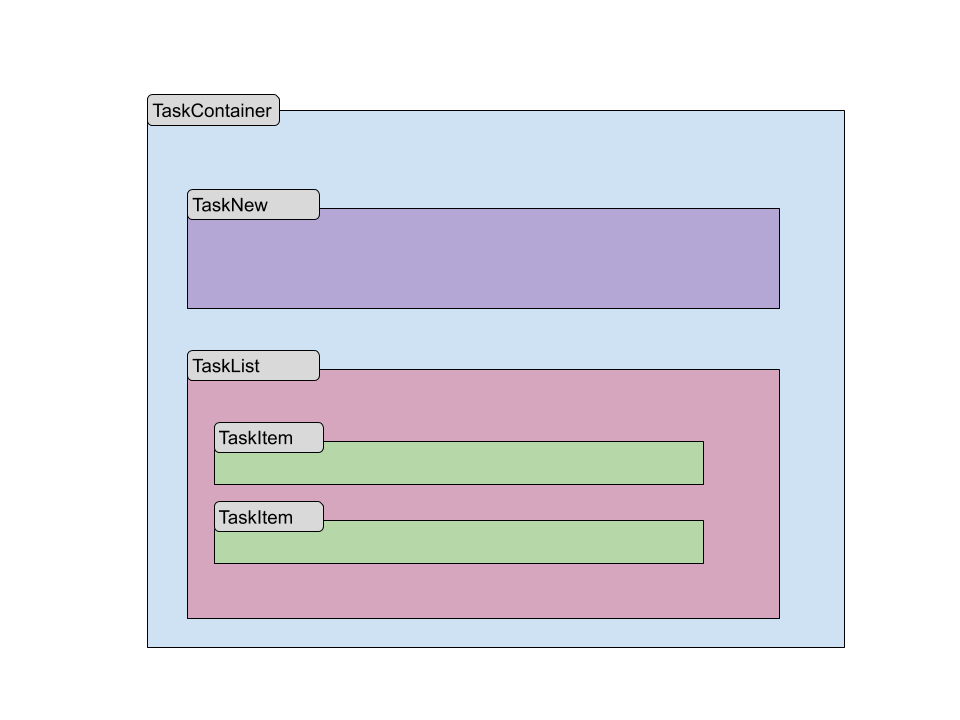

## Objetivo

Desarrollar una herramienta para gestion de tareas.

Se utilizara el siguiente esquema de componentes:

### 1. Crear componente "Contenedor de tareas"

- Crear un componente llamado "TaskContainer" en el path "src/componentes"
- Agregar un titulo en tag h3 "Gestion de tareas"
- Importar y agregar el componente "TaskContainer" en "App"

### 2. Crear componente "Nueva tarea"

- Crear un componente llamado "TaskNew." en el path "src/componentes"
- Agregar un input field con el label "nueva tarea"
- Agregar un boton con el label "agregar"
- Agregar un state denomiando "task", inicializar con String vacio
- Vincular el state "task" con el input field mediante v-model
- Al apretar el boton "agregar" emitir un evento denominado "newTask" y enviar como parametro el valor del state "task"
- Al apretar el boton "agregar" luego de emitir el evento blanquear el contenido del input
- Agregar una validacion al apretar el boton "agregar" que corrobore que task no esta vacio
- Importar y agregar el componente "TaskNew" al componente "TaskContainer"

### 3. Recepción de evento
- Agregar un state denominado "tasks" e inicializar como array vacio
- Recibir evento "newTask" agregando el parametro recibido "task" como un item del state "tasks"
- Verificar los states con  Devtools

### 4. Crear componente "Lista de tareas"

- Crear un componente llamado "TaskList" en el path "src/componentes"
- Agregar una prop denominada "tasks" del tipo array
- Agregar un titulo en tag h4 "Lista de tareas"
- Importar y agregar el componente "TaskList" al componente "TaskContainer"
- Desde "TaskContainer" inyectar la variable del estado interno "tasks" en la prop "tasks" del componente "TaskList"

### 5. Crear componente "item de lista de Tarea"

- Crear un componente llamado "TaskListItem" en el path "src/componentes"
- Agregar una prop "task" del tipo String
- Agregar una prop "id" del tipo Number
- Imprimir el valor de "task" dentro del tag "<li>"

### 6. Mostrar lista de items 
- Importar y agregar el componente "TaskListItem" poniendolo dentro del for inyectando la prop "id" y "task"
- Agregar la etiqueta <ul> dentro de "TaskList"
- Agregar un v-for en la etiqueta <ul> e iterar la prop "tasks"

### 7. Eliminar tarea
- Agregar un boton "eliminar" en el componente "TaskListItem"
- Al presionar el boton "eliminar" solicitar confirmación
- Al presionar el boton "eliminar" emitir un evento "delete-task" (kebab-case) enviando como parametro el id de la tarea 
- Generar un eventHub para emit evento desde "TaskListItem" y recibir en "TaskContainer" 
- Eliminar la tarea del state "tasks" dentro de "TaskContainer"

### 8. Agregar Store
- remplazar el eventhub por un store de vuex

